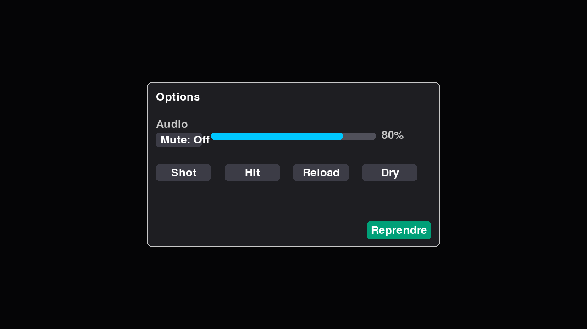

# Gesture Shooting Game (Jeu de tir gestuel)

<!-- Badges CI & Coverage -->
[](https://github.com/Ahmedable33/geste-shooter/actions/workflows/ci.yml)
[](https://codecov.io/gh/Ahmedable33/geste-shooter)

Un jeu de tir contrôlé par les gestes de la main via webcam, développé en Python avec OpenCV, MediaPipe et Pygame.

## Structure du projet
```
gesture_shooter/
├── main.py
├── game_engine.py
├── hand_tracker.py
├── targets.py
└── assets/
    └── sprites/
        └── .gitkeep
```

## Prérequis
- Python 3.9+
- Webcam fonctionnelle

## Installation
Dans le dossier racine du projet `game/` :
```bash
# Optionnel mais recommandé : créer un environnement virtuel
python3 -m venv .venv

# Installer les dépendances
.venv/bin/pip install -r requirements.txt
```
Sans environnement virtuel, vous pouvez utiliser :
```bash
python3 -m pip install --user -r requirements.txt
```

## Lancement du jeu
Depuis le dossier `game/` :
```bash
.venv/bin/python gesture_shooter/main.py
# ou
python3 gesture_shooter/main.py
```

## Gestes supportés
- "Shoot" (tir) : index tendu, autres doigts repliés.
- "Reload" (recharger) : poing fermé (tous les doigts repliés).
- "Pause" : main ouverte (index, majeur, annulaire, auriculaire tendus).

Le viseur suit le bout de l'index. Une calibration simple et un filtre de mouvement réduisent les tremblements.

## Contrôles clavier
- `Esc` : quitter
- `P` : pause
- `R` : recharger
- `Espace` : tirer (contrôle clavier)
- `1` : difficulté "Easy"
- `2` : difficulté "Normal"
- `3` : difficulté "Hard"
- `M` : couper/rétablir le son (mute)
- `O` : ouvrir/fermer le menu Options
- `-` / `+` (ou pavé num.) : diminuer / augmenter le volume
  - Astuce: sur certains claviers, la touche `+` correspond à `=` avec `Shift`.

## Gameplay
- Cibles de trois types :
  - statique (verte, 10 points)
  - mobile (jaune, 20 points)
  - petite (rouge, 30 points)
- Munitions : 6 balles. Rechargement par geste ou touche `R`.
- Difficulté dynamique : la fréquence d'apparition des cibles augmente avec le temps.

## Niveaux de difficulté
Trois niveaux, sélectionnables pendant la partie avec les touches `1`, `2`, `3` (et affichés en haut à droite):
- Easy: plus de munitions, cibles plus grandes et plus lentes, apparition moins fréquente.
- Normal: paramètres par défaut.
- Hard: moins de munitions, cibles plus petites et plus rapides, apparition plus fréquente, score majoré.

## Effets et sons
- Effets visuels: flash de tir au viseur et particules d'explosion lors d'un impact.
- Effets sonores: tir, impact, rechargement.

Placez vos fichiers audio (optionnels) dans `gesture_shooter/assets/sounds/`:
```
gesture_shooter/assets/sounds/
├── shot.wav
├── hit.wav
├── reload.wav
└── dry.wav
```
Si un fichier est manquant ou si l'audio n'est pas disponible, le jeu continue sans son.

## Menu Options
- Ouverture/fermeture: touche `O`. Le jeu se met automatiquement en pause quand le menu est ouvert.
- Mute: bouton « Mute » pour couper/rétablir le son.
- Volume: barre de volume cliquable/drag pour régler le volume maître (affiché en %). Les raccourcis `-` et `+` fonctionnent aussi.
- Aperçu des sons: boutons « Shot », « Hit », « Reload », « Dry » pour écouter un aperçu. Raccourcis clavier: `1`/`2`/`3`/`4`.
- Reprendre: bouton « Reprendre » pour fermer le menu et revenir au jeu.
- Indications utiles:
  - HUD en jeu: « Audio: Off » signifie que l’audio Pygame n’a pas pu s’initialiser (vérifiez votre serveur audio).
  - « Audio: Muted » quand le son est coupé. « Vol: XX% » quand l’audio est actif.

## Captures

Menu Options (touche `O`):



Astuce pour capturer:
- En jeu, appuyez sur `F12` pour enregistrer un screenshot (dossier `screenshots/`).
- Ou générez une capture du menu en mode headless:
  ```bash
  .venv/bin/python scripts/capture_options_screenshot.py
  ```

## Dépannage
- Webcam non détectée : vérifiez les permissions et que `cv2.VideoCapture(0)` fonctionne (utilisez un autre index de caméra si besoin).
- Performances : réduisez la résolution de la caméra/écran, fermez les applications lourdes.
- Problèmes d'installation Linux : assurez-vous d'avoir les dépendances système pour Pygame et OpenCV (SDL, etc.).

## Intégration continue (CI)
Un workflow GitHub Actions est fourni: `/.github/workflows/ci.yml`.

Ce pipeline:
- installe Python 3.12 et les dépendances système OpenCV (`libgl1`, `libglib2.0-0`)
- installe les dépendances Python (`requirements.txt`) et `pytest-cov`
- exécute les tests en mode headless (`SDL_VIDEODRIVER=dummy`, `SDL_AUDIODRIVER=dummy`)
- génère un rapport de couverture `coverage.xml` et le publie comme artefact

Pour l'activer:
1. Créez un dépôt GitHub et pointez ce projet dessus.
2. Poussez la branche `main` ou `master`.
3. Consultez l'onglet "Actions" de GitHub pour voir l'exécution.

Commandes utiles (exemple):
```bash
git init
git add .
git commit -m "Init Gesture Shooter"
git branch -M main
git remote add origin git@github.com:<votre-user>/<votre-repo>.git
git push -u origin main
```

## Licence
MIT
